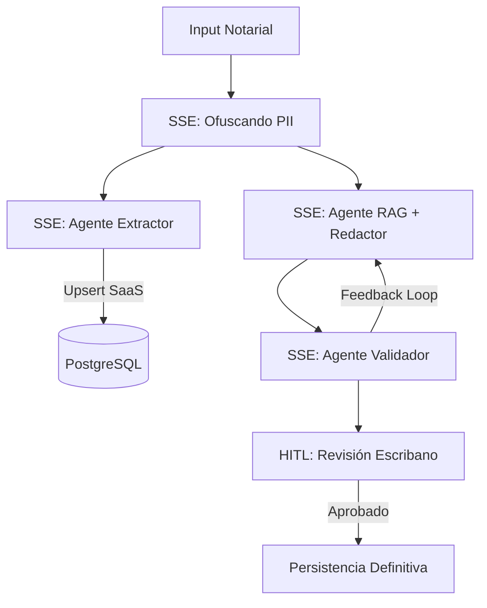

# OfiSolve: ERP Notarial SaaS Pro (Multi-Agent Cyclic Architecture)

OfiSolve es el primer **ERP Notarial SaaS con Inteligencia Artificial** diseñado específicamente para el mercado argentino. Automatiza el Data Entry (Cero Tipeo) mediante la extracción estructurada de entidades y garantiza la integridad jurídica a través de un grafo multi-agente cíclico con aprobación humana (HITL).

---

## 🏗 Arquitectura "Fase 4: Streaming & SaaS"

El sistema ha sido refactorizado para soportar flujos de trabajo profesionales de grado empresarial:

### Orquestación Multi-Agente (SSE Streaming)
El sistema opera bajo un flujo de alta integridad con visualización en tiempo real:



### Flujo de Trabajo HITL (Human-in-the-Loop)
1. **Generación Streaming**: El usuario observa token-a-token cómo la IA redacta el documento, consultando la normativa (RAG) interna.
2. **Edición Pro**: Una vez finalizada la redacción, el documento se abre automáticamente en un editor enriquecido (Quill).
3. **Aprobación Notarial**: El escribano realiza los ajustes finales y presiona "Aprobar y Finalizar", lo que persiste el contenido en la base de datos PostgreSQL del Workspace actual y cierra el trámite.

---

## 🛠 Diferenciales Tecnológicos

- **SaaS Nativo**: Aislamiento total por `workspace_id` y gestión de trámites multi-cliente.
- **Streaming SSE**: Interfaz reactiva que muestra qué nodo del agente está procesando en cada momento.
- **Privacidad Local**: Ofuscación PII vía **Presidio** antes de interactuar con el LLM (Gemini 2.0 Flash).
- **Consistencia Relacional**: Extracción automática de entidades integrada con SQLAlchemy y `asyncpg`.

---

## 🚀 Despliegue de Desarrollo

1. **Backend (FastAPI - Puerto 8000)**:
   ```bash
   cd backend
   pip install -r requirements.txt
   python main.py
   ```
2. **Frontend (Next.js - Puerto 3001)**:
   ```bash
   cd frontend/ui
   npm install
   npm run dev -- -p 3001
   ```

---

## 🗺 Hoja de Roadmap
- [x] **Agentes Cíclicos**: Validación y redacción asistida.
- [x] **Persistencia SaaS**: Extracción de entidades y PostgreSQL.
- [x] **Streaming & HITL**: Visualización real-time y aprobación humana. (Fase 4 ✅)
- [ ] **Firma Digital**: Integración con tokens criptográficos.
- [ ] **Expediente Digital**: Gestión por Trámite con versionado.

© 2026 OfiSolve Team - Automatización Inteligente para Escribanías Argentinas.
