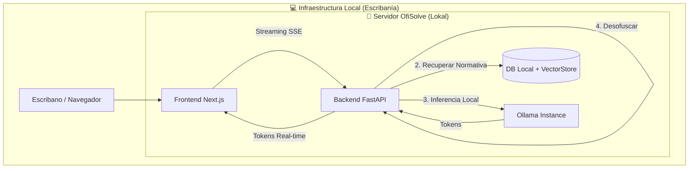

# OfiSolve: IA Notarial Soberana (Edición Lokal)

> **"La Fe Pública, potenciada por IA local."**  
> OfiSolve es un asistente notarial de grado empresarial diseñado para escribanías argentinas, donde la **privacidad extrema** y la **soberanía de datos** son el núcleo del producto. Toda la inteligencia corre en tu infraestructura, sin datos viajando a la nube de Google u OpenAI.

---

## 1. El Stack Soberano (Lokal-First)

Hemos migrado OfiSolve a una arquitectura 100% privada para garantizar el secreto profesional notarial:

- **Motor de IA (LLM)**: [Ollama](https://ollama.com/) corriendo **Llama 3.1 (8B)** o **Mistral**.
- **Memoria de Vectores (Embeddings)**: `nomic-embed-text` vía Ollama.
- **Privacidad (PII)**: [Microsoft Presidio](https://microsoft.github.io/presidio/) + spaCy (anonimización antes del LLM).
- **Orquestación**: LangGraph (Grafos de agentes con estado) + LangChain.
- **Backend Real-Time**: FastAPI con Streaming SSE (Server-Sent Events).
- **Base de Datos**: PostgreSQL + pgvector (SaaS Ready) / SQLite (Dev).
- **Frontend**: Next.js 15 (App Router) con estética "NotebookLM" y Glassmorphism.

---

## 2. Arquitectura del Sistema



---

## 3. Funcionalidades Clave

1.  **Chat Notarial con Memoria**: Conversación fluida que recuerda el contexto del trámite y mensajes anteriores.
2.  **WelcomeHero UX**: Pantalla de bienvenida dinámica que sugiere acciones basadas en el estado de la escribanía.
3.  **Generación de Documentos**: Redacción automática de Certificaciones de Firmas, Fotocopias, Autorizaciones y Supervivencias siguiendo la Ley 404 y CECBA.
4.  **Soberanía de Datos**: Los datos sensibles (DNI, Nombres, Direcciones) son anonimizados por un agente de privacidad antes de pasar al motor de inferencia.

---

## 4. Guía de Inicio Rápido (Dev Mode)

### Requisitos
- Ollama instalado y corriendo (`ollama serve`).
- Modelos necesarios: `ollama pull llama3.1:8b` y `ollama pull nomic-embed-text`.

### Backend
```bash
cd backend
python -m venv .venv
source .venv/bin/activate
pip install -r requirements.txt
python -m spacy download es_core_news_sm
# Inicializar los vectores de normativa notarial
python scripts/init_rag.py --reset
python main.py
```

### Frontend
```bash
cd frontend/ui
pnpm install
pnpm dev
```

---

## 5. Próximos Pasos (Hoja de Roadmap Real)

Tras la exitosa migración a Ollama, el enfoque para las próximas fases es:

### 🔴 Urgente (Estabilización)
- [ ] **Aislamiento Multitenant**: Verificar que cada `tenant_id` tenga persistencia aislada de hilos de chat.
- [ ] **Optimización de Latencia**: Implementar cuantificación de modelos (GGUF) para optimizar el uso de VRAM local.

### 🟡 Corto Plazo (Capacidad Legal)
- [ ] **Ingesta Masiva de Protocolos**: Ampliar el RAG con los últimos 10 años de resoluciones del Colegio de Escribanos.
- [ ] **Firma Digital Integrada**: Permitir el sellado PDF directamente desde el editor de OfiSolve.

### 🔵 Largo Plazo (Visión ERP)
- [ ] **Módulo de Libros**: Automatización del Libro de Requerimientos y sellado cronológico.
- [ ] **App Mobile**: Captura de DNIs vía cámara con OCR local para evitar carga manual.

---

*"Doy fe por la tecnología, protejo por la privacidad." — OfiSolve Team, 2026*
